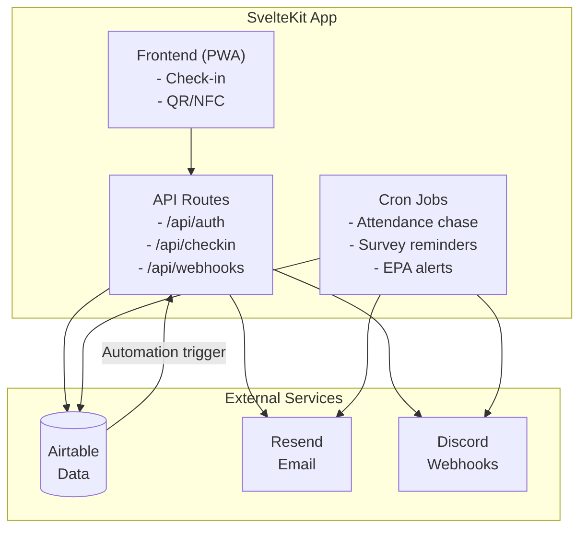
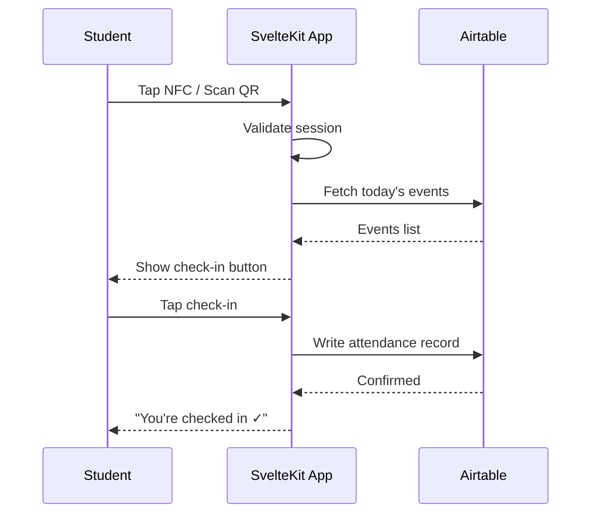
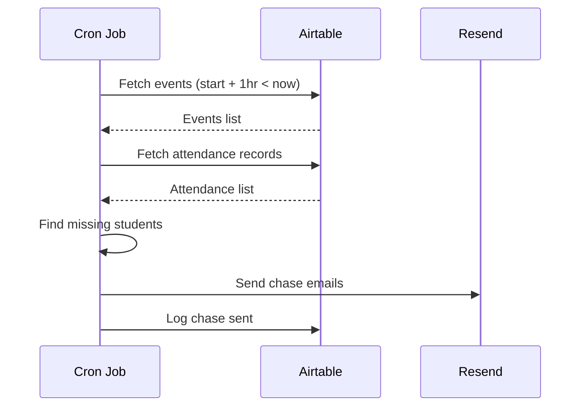
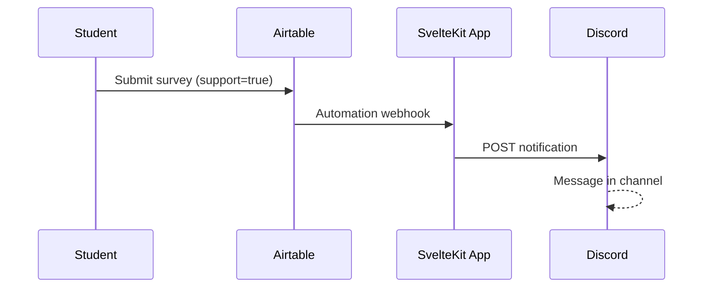
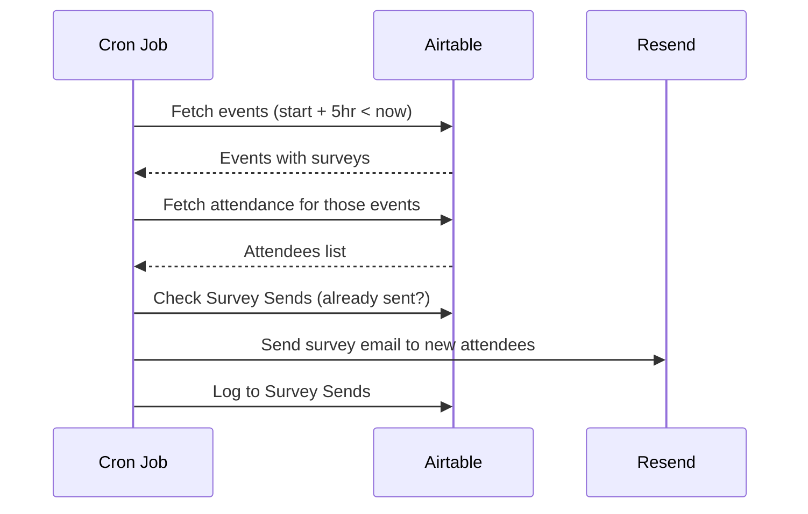
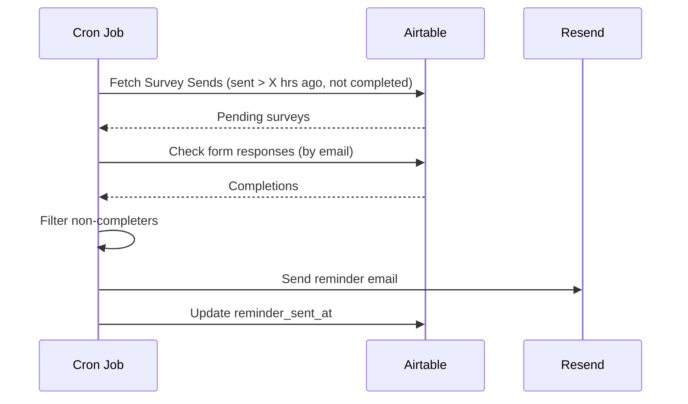

# Apprentice Pulse - Architecture

## Overview

Apprentice Pulse is an automation and monitoring layer that sits on top of existing Airtable bases. It automates attendance tracking, progress review workflows, and early intervention alerts for at-risk learners.

## System Diagram



## Components

### Frontend (PWA)

Mobile-first web app for student attendance check-in.

**Check-in flow:**
1. Student taps NFC sticker or scans QR code → opens app
2. First visit: enter email → magic link → session stored (90 days)
3. Subsequent visits: tap → check in → done (single action)

**Event detection:**
- App fetches today's events from Airtable
- Filters to events within ±1 hour of current time
- Single event: one-tap check-in
- Multiple events: show list to select
- No events: display "No session right now"

### API Routes

Server-side endpoints handling:

| Route | Purpose |
|-------|---------|
| `/api/auth/send-link` | Send magic link email |
| `/api/auth/verify` | Verify magic link token, create session |
| `/api/checkin` | Record attendance to Airtable |
| `/api/events` | Fetch today's events |
| `/api/webhooks/airtable` | Receive Airtable automation triggers |

### Cron Jobs

Scheduled tasks running on Vercel Cron:

| Schedule | Job | Action |
|----------|-----|--------|
| Every 15 min | Attendance chase | Email students not checked in 1hr after event start |
| Every 15 min | Event survey send | Send survey to attendees 5hrs after event start |
| Every 15 min | Scheduled survey send | Send recurring surveys at configured time (e.g., Tues 10am) |
| Every 15 min | Survey reminder | Chase non-completers X hours after survey sent |
| Daily 9am | Support follow-up | Alert if support request not actioned within timeframe |
| Weekly | EPA timeline check | Flag learners at risk of missing EPA deadlines |

## External Services

### Airtable (Database)

Existing bases:
- Attendance (Current)
- Weekly Learning Log
- Progress reviews
- Events/Sessions

New/updated tables for surveys:

| Table | Purpose |
|-------|---------|
| Scheduled Surveys | Recurring surveys config (day, time, form URL, cohort) |
| Events | Add column: survey form URL (select: none or form) |
| Survey Sends | Log: student email, survey, sent_at, completed_at |

Survey completion is tracked by matching email from Airtable form responses against Survey Sends.

The app reads and writes via Airtable REST API. Airtable remains the source of truth.

### Resend (Email)

Transactional email for:
- Magic link authentication
- Attendance reminders
- Survey chase-ups
- Support request notifications

### Discord (Notifications)

Webhook integration for real-time staff alerts:
- Student requests support
- Low attendance warnings
- EPA timeline alerts

## Data Flow

### Attendance Check-in



### Attendance Chase



### Support Request Alert



### Event Survey Send



### Survey Reminder



## Tech Stack

| Layer | Choice |
|-------|--------|
| Framework | SvelteKit |
| Language | TypeScript |
| Testing | Vitest |
| Auth | Magic link (custom) |
| Database | Airtable |
| Email | Resend |
| Notifications | Discord webhooks |
| Hosting (temp) | Vercel |
| Hosting (prod) | Heroku |
| Scheduled jobs | Vercel Cron |

## Environment Variables

```
AIRTABLE_API_KEY=
AIRTABLE_BASE_ID=
RESEND_API_KEY=
DISCORD_WEBHOOK_URL=
MAGIC_LINK_SECRET=
SESSION_SECRET=
```