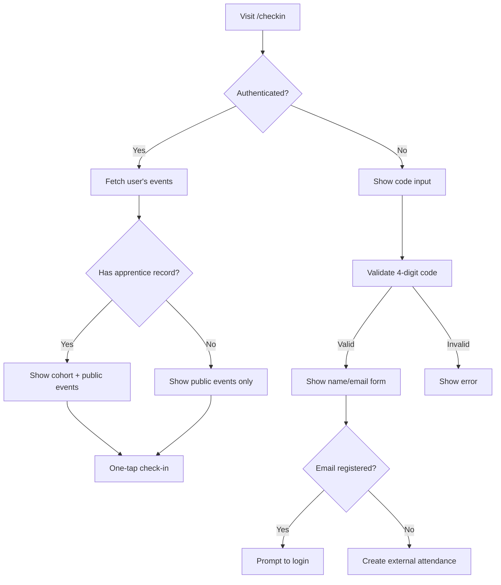

# Creating the project (Boilerplate)
I created the boiler plate code, basic CI and deployment at the very beggining off the project (AP-3, AP-2, AP-8).
The idea is to have as soon as possible a "Hello world". In this context that would be a deployed sveltkit app that can read and write a value on Airtable.

# Testing Strategy

We use Vitest for automated testing with a co-location pattern: test files (`.spec.ts`) live next to the source files they test. This makes tests easy to find and encourages test coverage.

**Structure:**
- `src/lib/**/*.spec.ts` - Unit tests for library code
- `src/routes/**/*.spec.ts` - Component tests for pages

**Manual integration scripts** live in `scripts/` and are used for verifying real API connectivity during development:
- `scripts/check-airtable-connection.ts` - Verify Airtable read/write access
- `scripts/check-cohort-apprentices.ts` - Test cohort lookup functionality
- `scripts/fetch-schema.ts` - Fetch and document Airtable schema

This separation keeps automated tests (fast, mocked, run in CI) distinct from manual integration checks (slow, real API, run during development). [P6 - 30%] [P7 - 30%]


# Importing Airtable schema
To avoid possible errors when mapping the Airtable tables and fields I created the script `scripts/fetch-schema.ts`. This script uses the Airtable Metadata API to fetch the schema from configured bases (Learners and Learner Feedback). It presents an interactive checkbox prompt allowing selection of which tables to document, then generates a markdown file (`scripts/fetch-schema-output.md`) containing the field names and types for each selected table. This ensures the codebase stays in sync with the actual Airtable structure and serves as reference documentation for the team.

# Refereing Airtable Tables and fields by their IDs.
Instead of using their names, we will refer to tables and fields using their IDs, so there is no danger with users changing the name of a table and breaking the whole system


# Reusable Airtable Client with Factory Pattern

To prepare for the attendance tracking MVP and future features, I refactored the Airtable integration into a reusable module using the factory pattern. This allows the same business logic to work both in SvelteKit (server-side) and standalone scripts.

## Structure

- **`src/lib/airtable/airtable.ts`** - Core client with `createAirtableClient()` factory function. Contains all business logic and is framework-agnostic.
- **`src/lib/airtable/sveltekit-wrapper.ts`** - Thin wrapper that uses SvelteKit's `$env/static/private` to configure the client.

## Implementation

The factory pattern accepts credentials and returns an object with utility functions:

```typescript
export function createAirtableClient(apiKey: string, baseId: string) {
	Airtable.configure({ apiKey });
	const base = Airtable.base(baseId);

	async function getApprenticesByFacCohort(facCohort: string): Promise<Apprentice[]> {
		// ... implementation
	}

	return { getApprenticesByFacCohort };
}
```

**Usage in SvelteKit:**
```typescript
import { getApprenticesByFacCohort } from '$lib/airtable/sveltekit-wrapper';
const apprentices = await getApprenticesByFacCohort('FAC29');
```

**Usage in scripts:**
```typescript
import { createAirtableClient } from '../src/lib/airtable/airtable.ts';
const client = createAirtableClient(apiKey, baseId);
const apprentices = await client.getApprenticesByFacCohort('FAC29');
```

## Key decisions

- **Field IDs with `returnFieldsByFieldId: true`**: Makes the code resilient to field renames in Airtable
- **Typed `Apprentice` interface**: Provides type safety for consuming code
- **Lookup field handling**: Email is a lookup field that returns an array, handled with `emailLookup?.[0] ?? null`

This refactoring enables code reuse across the application while keeping environment-specific configuration isolated. [P5 - 75%] [D2 - 60%]


# Task Delegation and Team Coordination

During Sprint 02, I identified that certain tasks required permissions I did not have (e.g., Airtable schema modifications, access to specific bases). Rather than letting these become blockers, I added Jess to the Jira board and assigned the relevant tasks to her. This allowed me to clearly distinguish between work I could progress independently and work that was pending on others.

This approach improved visibility into the project status and helped me prioritise effectively, focusing on tasks within my control while maintaining a clear follow-up list for delegated items. [P1 - 50%] [P2 - 40%] [K2, K6]

# Authentication
We use jsonwebtoken library to authenticate learners and staff. This allows us to:
  * Generate the magic link token
  * Verify the token

**API testing:** We use Postman to manually test the authentication endpoints during development. This allows us to verify request/response payloads and debug the auth flow before building the frontend.

## Role-based Access Control

The `findUserByEmail` function implements role-based authentication by checking two Airtable tables:

1. **Staff table** - Returns `type: 'staff'` for admin access
2. **Apprentices table** - Returns `type: 'student'` for learner access

A technical challenge arose with the Staff table: the email is stored in a `singleCollaborator` field (an Airtable collaborator object with `{ id, email, name }`). Unlike regular text fields, collaborator fields cannot be filtered using Airtable's `filterByFormula`. The solution was to fetch all staff records and iterate through them in code, comparing emails case-insensitively:

```typescript
for (const record of staffRecords) {
	const collaborator = record.get(STAFF_FIELDS.COLLABORATOR);
	if (collaborator?.email?.toLowerCase() === email.toLowerCase()) {
		return { type: 'staff' };
	}
}
```

This approach ensures staff members can authenticate regardless of how their email is capitalised in Airtable. [K2 - 40%] [S5 - 30%] [D2 - 20%]


# Role-Based Route Protection (AP-15)

Implemented centralised route protection using SvelteKit hooks. This moves authentication checks from individual page load functions to a single middleware, reducing code duplication and ensuring consistent access control.

## Implementation

**Session helpers** (`src/lib/server/session.ts`):
- `getSession(cookies)` - Parse and validate session cookie
- `setSession(cookies, data)` - Set session with 90-day expiry
- `clearSession(cookies)` - Delete session cookie

**Route protection** (`src/hooks.server.ts`):
```typescript
const ADMIN_ROUTES = ['/admin'];
const PROTECTED_ROUTES = ['/checkin'];
const AUTH_ROUTES = ['/login'];

// In handle function:
if (isPathMatch(pathname, ADMIN_ROUTES)) {
	if (!session) redirect(303, '/login?redirect=' + encodeURIComponent(pathname));
	if (session.type !== 'staff') redirect(303, '/');
}
```

## Route protection rules

| Route Pattern | Access | Redirect if denied |
|--------------|--------|-------------------|
| `/admin/*` | Staff only | → `/login` (no session) or `/` (students) |
| `/checkin` | Any authenticated user | → `/login` |
| `/login` | Unauthenticated only | → `/admin` (staff) or `/` (students) |
| Other routes | Public | - |

## Key decisions

- **Centralised in hooks**: Single source of truth for route protection, easier to audit and modify. Avoids duplicating auth checks in every page's load function. [P5 - 70%] [D2 - 60%]
- **Redirect parameter**: Login preserves intended destination via `?redirect=` query param, improving user experience after authentication
- **API routes excluded**: `/api/*` routes handle their own auth to support different response formats (JSON vs redirects)
- **Session helpers module**: Extracted cookie handling into reusable functions (`getSession`, `setSession`, `clearSession`) following DRY principles [K7 - 50%] [S17 - 60%]


# Attendance Service with Cross-Table Validation (AP-21)

Extended the Airtable factory pattern to create an attendance service module. A key design decision was implementing validation at the service layer rather than the API layer.

## Validation Pattern

The `createAttendance` and `createExternalAttendance` functions validate against the Events table before creating records:

```typescript
async function createAttendance(input: CreateAttendanceInput): Promise<Attendance> {
    // Validate event exists
    const eventInfo = await getEventInfo(input.eventId);
    if (!eventInfo.exists) {
        throw new Error('Event not found');
    }

    // Prevent duplicate check-in
    const alreadyCheckedIn = await hasUserCheckedIn(input.eventId, input.apprenticeId);
    if (alreadyCheckedIn) {
        throw new Error('User has already checked in to this event');
    }

    // Create record...
}
```

## Design Decision: Service Layer vs API Layer Validation

| Approach | Pros | Cons |
|----------|------|------|
| **Service layer** (chosen) | Reusable across API routes, testable in isolation, single source of truth | Extra queries per request |
| API layer | Could batch validations, closer to request context | Duplicated logic if multiple endpoints use same service |

Chose service layer validation because the attendance functions will be used by multiple API endpoints (student check-in, admin manual check-in, potential future bulk operations). [P5 - 60%] [D2 - 50%] [K7 - 40%]

## Testing Validation Scenarios

Created 13 unit tests covering both success paths and validation failures:

- Event not found → throws error
- User already checked in → throws error
- External check-in on non-public event → throws error
- Email already checked in → throws error

This ensures validation logic is tested in isolation from the API layer. [P6 - 40%] [P7 - 40%]


# Unified Check-in Page with Adaptive UI (AP-22)

Created a single check-in page at `/checkin` that adapts its interface based on authentication state, supporting both registered users and guest attendees.

## Adaptive UI Pattern

The page renders different views based on authentication status, determined server-side:

```typescript
// +page.server.ts
export const load: PageServerLoad = async ({ locals }) => {
    if (!user) {
        return { authenticated: false, events: [], checkInMethod: null };
    }
    // ... fetch events for authenticated user
    return { authenticated: true, events: eventsWithStatus, checkInMethod };
};
```

```svelte
<!-- +page.svelte -->
{#if data.authenticated}
    <!-- Event list with one-tap check-in -->
{:else}
    <!-- Guest flow: code → details → success -->
{/if}
```

This approach avoids separate routes while providing tailored experiences for each user type. [P5 - 70%] [D4 - 50%]

## User Flow Diagram



## Live Countdown Timer

Added a real-time countdown that updates every second, providing visual feedback on event timing:

```typescript
// Reactive timer updates every second
let now = $state(Date.now());
const timerInterval = setInterval(() => { now = Date.now(); }, 1000);
onDestroy(() => clearInterval(timerInterval));

function getTimeStatus(dateTime: string) {
    const diff = new Date(dateTime).getTime() - now;
    if (diff > 0) {
        return { text: 'Starts in Xh Xm Xs', isLate: false, isStartingSoon: diff < 10 * 60 * 1000 };
    }
    return { text: 'Xm late', isLate: true, isStartingSoon: false };
}
```

The timer uses `font-variant-numeric: tabular-nums` to prevent layout shifts as digits change. Visual states:
- **Blue**: Event upcoming (normal)
- **Orange**: Starting within 10 minutes
- **Red**: Event started, user is late

This provides immediate visual feedback encouraging timely attendance. [P3 - 40%] [S16 - 30%]

## Route Protection Update

Modified `hooks.server.ts` to allow unauthenticated access to `/checkin` for guest check-in support. The page handles authentication internally rather than redirecting to login.

```typescript
// Previously protected, now public with internal auth handling
const PROTECTED_ROUTES: string[] = []; // /checkin handles auth internally
```

Updated tests to reflect this change, verifying that unauthenticated users can access the page (for guest check-in) while authenticated users see their personalised event list. [P6 - 30%] [P7 - 35%]

## Development Environment Cookie Fix

Fixed session cookies for local development by making the `Secure` flag environment-aware:

```typescript
import { dev } from '$app/environment';

cookies.set('session', JSON.stringify(data), {
    secure: !dev,  // false in dev (HTTP), true in production (HTTPS)
    // ...
});
```

This resolved "Authentication required" errors when testing locally over HTTP. [P8 - 50%] [D3 - 40%]


# Performance Optimisation: Parallelising API Calls

During roster loading testing, I noticed the event roster was taking ~1.5 seconds to load. Using structured debugging, I traced through the request flow and identified the bottleneck: four sequential Airtable API calls.

## Problem Analysis

Original roster endpoint flow (sequential):
```
getEvent()              → ~300ms
getAttendanceByIds()    → ~300ms
getApprenticesByCohortId() → ~300ms
getApprenticesByIds()   → ~300ms (for non-cohort attendees)
─────────────────────────────────
Total: ~1.2-1.5s
```

The key insight was that `getAttendanceByIds()` and `getApprenticesByCohortId()` are independent—neither depends on the other's result. They only depend on the event data.

## Solution: Promise.all for Independent Operations

Refactored to run independent calls in parallel:

```typescript
// Before: Sequential (slow)
const attendance = await getAttendanceByIds(event.attendanceIds ?? []);
const cohortApprentices = event.cohortId
    ? await getApprenticesByCohortId(event.cohortId)
    : [];

// After: Parallel (fast)
const [attendance, cohortApprentices] = await Promise.all([
    getAttendanceByIds(event.attendanceIds ?? []),
    event.cohortId ? getApprenticesByCohortId(event.cohortId) : Promise.resolve([]),
]);
```

## Results

| Metric | Before | After | Improvement |
|--------|--------|-------|-------------|
| Average load time | ~1.5s | ~0.9s | 40% faster |
| API calls | 4 sequential | 2 sequential + 2 parallel | - |

The remaining sequential call (`getApprenticesByIds` for non-cohort attendees) genuinely depends on attendance data, so it must remain sequential. [P8 - 60%] [D2 - 50%] [D3 - 50%]


# Automatic Late Status Detection

Extended the attendance service to automatically mark check-ins as "Late" when they occur after the event start time.

## Implementation

Added `determineStatus()` function that compares timestamps:

```typescript
function determineStatus(eventDateTime: string | null): 'Present' | 'Late' {
    if (!eventDateTime) {
        return 'Present';  // No event time means we can't determine lateness
    }

    const eventTime = new Date(eventDateTime);
    const now = new Date();

    return now > eventTime ? 'Late' : 'Present';
}
```

Both `createAttendance()` and `createExternalAttendance()` now call `determineStatus()` instead of hardcoding `'Present'`.

## Design Decision: Service Layer Logic

The late detection happens in the attendance service, not the API endpoint. This ensures consistency regardless of how attendance is created (user check-in, admin manual entry, future bulk import). [P3 - 40%] [P5 - 50%] [D4 - 30%]

# AP-26: Cohort Attendance Metrics Dashboard

Created a comprehensive cohort metrics dashboard that provides aggregate attendance statistics with drill-down capabilities and comparison features.

## Architecture Decisions

### 1. Server-Side Data Aggregation
All attendance statistics are calculated server-side in `getCohortAttendanceStats()` rather than client-side. This provides:
- Consistent metrics across all views
- Reduced client-side computation
- Easier caching opportunities in the future
- Single source of truth for business logic

### 2. Reactive State Management with Svelte 5 Runes
Used Svelte 5's new runes (`$state`, `$derived`, `$effect`) for reactive state management:

```typescript
// Sorting and filtering computed reactively
const sortedCohortStats = $derived(() => {
    const sorted = [...data.cohortStats];
    // Complex sorting logic
    return sorted;
});

// Export data always reflects current view
const exportData = $derived(() =>
    sortedCohortStats.map(cohort => ({
        Cohort: cohort.cohortName,
        'Attendance Rate': `${Math.round(cohort.attendanceRate)}%`,
        // ... other fields
    }))
);
```

This ensures UI updates automatically when filters or sort orders change. [P8 - 70%] [D2 - 60%]

### 3. Responsive Design Pattern
Implemented responsive table/card switching using Tailwind's responsive utilities:
- Desktop: Full data table with all columns
- Mobile: Card-based layout with key metrics
- No JavaScript media queries needed - pure CSS solution

### 4. Comparison Feature with SvelteSet
Used `SvelteSet` for managing selected cohorts for comparison, wrapped in `$state` for reactivity:

```typescript
let selectedForComparison = $state(new SvelteSet<string>());
```

This provides O(1) lookups while maintaining reactivity. The comparison view uses CSS Grid for responsive side-by-side layout. [P5 - 60%]

### 5. CSV Export with Error Boundaries
Implemented client-side CSV generation with comprehensive error handling:
- Validation of data availability before export
- Try-catch blocks around CSV generation
- User-friendly error messages
- Automatic filename generation with timestamp

This follows the principle of graceful degradation - if export fails, the dashboard remains functional. [P7 - 40%] [D4 - 40%]

## Technical Implementation Details

### Date Range Filtering
While the UI supports date range parameters, the backend `getCohortAttendanceStats()` doesn't yet filter by date. This was intentionally left as a TODO to avoid scope creep in the MVP. The architecture supports it - just needs the filter logic added to the Airtable query.

### Performance Optimizations
- Sequential API calls for cohort stats (could be parallelized in future)
- No unnecessary re-renders thanks to `$derived` computations
- Lightweight CSV generation without external dependencies

### Loading States and Error Handling
Implemented consistent loading/error patterns across all admin views:
- Loading overlay during navigation
- Error state with retry capability
- Empty state messaging
- Form validation feedback

This creates a predictable user experience across the admin dashboard. [P11 - 40%]


# Roles and Responsibilities in the Software Development Lifecycle (P1)

This project was developed as a solo apprentice project with a clearly defined stakeholder relationship. Understanding the roles involved was essential to managing the work effectively.

## Project Roles

**Apprentice Developer (myself):** Responsible for the full software development lifecycle — requirements analysis, system design, implementation, testing, deployment, and documentation. Working as the sole developer meant taking ownership of all technical decisions while remaining accountable to the product owner at every sprint review.

**Product Owner — Jess (FAC):** Jess acts as the primary stakeholder and main end-user of the admin-facing features of the application. Her responsibilities within the SDLC are to define and prioritise requirements, validate delivered functionality during sprint reviews, and provide feedback that shapes the product backlog. In Sprint 2, Jess also took on a direct task: configuring Airtable schema changes (creating tables and fields) that required permissions I did not have. I assigned her the relevant Jira tickets (e.g. AP-10, AP-11, AP-12) and tracked her progress as a dependency, demonstrating how even small teams must manage handoffs within a SDLC.

**End users (Apprentices):** The student cohorts are the secondary user group, interacting with the check-in flow. Their needs (mobile-first UX, minimal friction, clear feedback) informed the design of the `/checkin` page. Although not directly involved in planning, their usage patterns — arriving late, attending multiple cohorts, checking in as guests — were captured in user stories and shaped implementation decisions.

## My Role Within the SDLC

Across the project I moved through each SDLC phase in sprint increments:

| SDLC Phase | My contribution |
|---|---|
| Requirements | Wrote 16 user stories across 4 epics; collaborated with Jess to prioritise by value |
| Design | Produced architecture diagram, data flow diagrams, and schema documentation |
| Implementation | Built all application code across 4 sprints |
| Testing | Wrote unit tests with Vitest; used Postman for API testing; created manual integration scripts |
| Deployment | Configured CI/CD pipeline and managed production releases to Vercel |
| Review | Conducted sprint reviews with Jess; iterated backlog based on feedback |

[P1 - 100%] [K2 - 80%] [K3 - 80%]


# How the Team Worked: Agile Process and Contribution (P2)

Although I was the sole developer, I applied structured Agile practices throughout to maintain momentum, visibility, and quality — the same practices I would use in a larger team.

## Sprint Structure

The project ran in one-week sprints (Sprint 1 was 4 days; Sprint 2 extended slightly over Christmas break). Each sprint followed a consistent rhythm:

- **Sprint planning:** I reviewed the backlog with Jess and agreed on the sprint goal and ticket scope. Tickets were estimated in story points and moved from the backlog to the sprint in Jira.
- **Daily self-review:** With no team standup, I tracked my own progress against the sprint board each morning, identifying blockers early.
- **Sprint review:** At the end of each sprint I demonstrated delivered features to Jess, captured her feedback, and updated the backlog accordingly. Sprint reviews are documented in `docs/planning/sprint0X_review.md`.
- **Sprint retrospective (solo):** I documented what went well and what to improve in each sprint review file, and carried action items into the next sprint.

## Version Control and Branching Strategy

I used a feature-branch workflow throughout:

- Each Jira ticket maps to a branch named `feature/ap-XX-short-description` (e.g. `feature/ap-26-cohort-attendance-metrics-view`)
- All work was developed on feature branches and merged to `main` via Pull Requests — even as the sole developer. This ensured a clean history, gave me a structured review moment before merging, and kept `main` always deployable.
- 21 PRs were merged across the project lifecycle, each with a descriptive summary of changes and a test plan.

This discipline mirrors professional team practice: PRs provide a record of intent, allow review (by a team member, or by myself with fresh eyes), and trigger the CI pipeline before code reaches main.

## Communication and Stakeholder Management

When tasks required Airtable permissions I did not have, I communicated this to Jess directly and assigned her the relevant Jira tickets rather than letting them become silent blockers. This kept the sprint board accurate and made dependencies visible.

Sprint reviews were the primary communication mechanism with the client. When Sprint 2 revealed that the events feature needed to support public (non-cohort) events — a requirement not captured initially — I split the story (AP-17 → AP-17 + AP-19), explained the reasoning to Jess, and adjusted the sprint plan. This shows how iterative delivery surfaces real requirements earlier than a waterfall approach would.

[P2 - 100%] [K6 - 80%] [D1 - 50%]


# Build, Deployment and Environment Management (P9)

## CI/CD Pipeline

The project uses a GitHub Actions pipeline defined in `.github/workflows/ci.yml`. It runs on every push to `main` and on every pull request targeting `main`.

The pipeline has two jobs:

**1. Test job** (runs on all PRs and pushes):
- Checks out the code
- Installs dependencies with `npm ci` (reproducible installs)
- Runs ESLint (`npm run lint`) — enforces code style and catches common errors
- Runs the full Vitest test suite (`npm test`)

No code can reach `main` without passing both lint and tests. This gate ensured that regressions were caught before merging throughout the project.

**2. Deploy job** (runs only on merge to `main`, after the test job passes):
- Installs the Vercel CLI
- Pulls the production environment configuration from Vercel (environment variables, project settings)
- Builds the project using Vercel's build pipeline
- Deploys the prebuilt output to Vercel production

The deploy job has a `needs: test` dependency, meaning a failed test run blocks deployment entirely. This gave confidence that every production release had passed CI.

## Environment Management

Sensitive configuration (Airtable API key, Resend API key, JWT secret, Discord webhook URL) is managed exclusively through environment variables — never committed to the repository. A `.env.example` file documents the required variables for onboarding. Vercel stores production secrets and the CI pipeline pulls them securely via `vercel pull` using a `VERCEL_TOKEN` stored as a GitHub Actions secret.

For local development, a `.env.local` file (gitignored) mirrors production config against the same Airtable base. One environment-specific fix was required: the `Secure` cookie flag had to be disabled in development (HTTP) while remaining enabled in production (HTTPS), handled with SvelteKit's `dev` import.

## Deployment Architecture

There is a single production environment — no dedicated staging. The feature-branch workflow mitigates this: code is reviewed and tested in CI before merging, so `main` is always in a releasable state. A merge to `main` triggers an automatic production deploy in approximately 1–2 minutes.

The target hosting platform is Heroku (production), but during development Vercel is used for its tight integration with the CI pipeline and zero-configuration SvelteKit support.

[P9 - 100%] [S10 - 80%] [S14 - 80%] [B1 - 60%]
